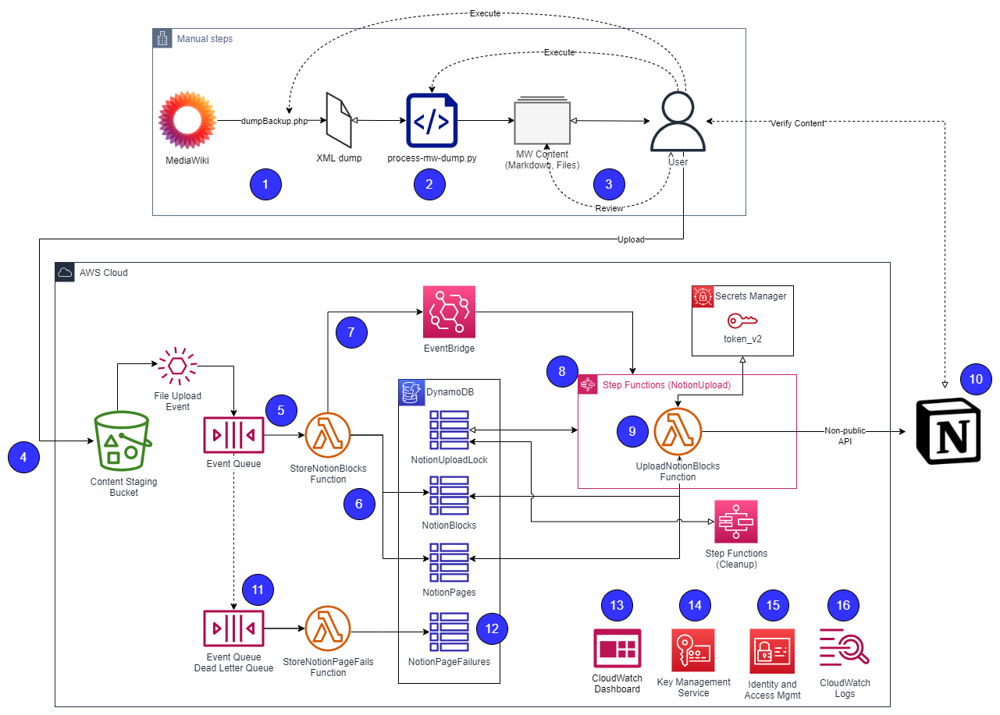

# A data pipeline for converting MediaWiki content to Notion pages

🚧 Neither this software not the author are affiliated with Notion. This is an unofficial, community-built solution.

📚 The documentation for this solution assumes a high level of technical ability on the part of the reader as well as familiarity with Python, Markdown, and AWS.

👀 You really should read this entire file top to bottom. Yes it's long, but that's because it's packed full of information you need to know if you're going to use this software.

🚨 The level of effort required to move your wiki content to Notion will largely be driven by how advanced your usage of MediaWiki is. Prepare to spend time massaging wiki content into Markdown format; prepare for multiple iterations of this. This solution provides some tooling to help, but you're the only one who can fully ensure the accuracy of the content processing and import.

## Table of Contents

* [Features](#features)
* [Solution Architecture](#solution-architecture)
* [Pre-requisites](#pre-requisites)
* [Installation](#installation)
* [Usage](#usage)
* [Help](#help)
* [Uninstall](#uninstall)
* [Limitations & Known Issues](#limitations--known-issues)
* [Acknowledgements](#acknowledgements)
* [License](#license)

## Features

This solution offers the following features:

- Conversion of MediaWiki wikitext to Markdown using the proven capabilities of [pandoc](https://pandoc.org/).
- Ample opportunity for review, correction, and iteration of the conversion process prior to importing to Notion.
- A mechanism to deal with use of MediaWiki templates in the wikitext.
- A (mostly) serverless, cloud-based architecture for pushing Markdown into Notion (see the solution architecture below).
- Scalability to import one, two, dozens, or hundreds of pages.
- Importing of content embedded in the MediaWiki pages such as PDFs and images.
- Importing pages to whichever Notion parent page(s) you'd like.
- Flexibility to batch MediaWiki pages however you want: by category, by size, by importance. Repeat a whole batch or a single page as and when you need to.
- A dashboard for understanding the performance of and any errors encountered by the import pipeline.
- The import pipeline can import any Markdown content, it doesn't have to be from Mediawiki.

Note this solution uses the non-public Notion API because the public API does not support content import.


## Solution Architecture

The solution has two phases:
1. Manual steps which extract and pre-process the MediaWiki content into Markdown.
2. The import pipeline which takes the Markdown and embedded content and imports it into Notion.



1. You use MediaWiki's `dumpBackup.php` script to dump the database to a file in XML format.
2. You run the `process-mw-dump.py` script from this repo to read the XML dump and extract each page and embedded file (PDF, image, etc) to a directory on your computer.
3. You review and organize the Markdown files as per your liking.
4. You upload one or more Markdown files along with the PDFs, images, etc, to the content staging bucket in your AWS account.
5. Uploading a `*.md` file to the bucket triggers the pipeline. Amazon S3 sends an event to Amazon Simple Queue Service (SQS) which in turn triggers the `StoreNotionBlocks` AWS Lambda function.
6. The `StoreNotionBlocks` function retrieves the Markdown file from the bucket and parses it into Notion blocks. The blocks are stored in a DynamoDB table.
7. Upon completion, the function sends a "blocks ready" event to a custom event bus in Amazon EventBridge.
8. An EventBridge rule is triggered by the "blocks ready" event and starts the `NotionUpload` state machine in AWS Step Functions. The state machine attempts to acquire a lock to ensure that only one instance of the state machine is doing work at a time. If it's unable to acquire the lock, it spins until the lock is acquired. With the lock acquired, the state machine runs the `UploadNotionBlocks` Lambda function.
9. The `UploadNotionBlocks` function reads the set of blocks belonging to the page which the `StoreNotionBlocks` function processed from DynamoDB. If the corresponding page doesn't yet exist in Notion, the page is created and its ID stored in DynamoDB. The function retrieves the Notion API token from AWS Secrets Manager and begins to pump blocks into the new Notion page. In order to handle large pages with many hundreds or even thousands of blocks which may take longer to upload than the max run time of a Lambda function, the function processes a fixed set of blocks before exiting. The state machine will invoke the function again until there are no more blocks for that page left in the DynamoDB table.
10. The new page and blocks start to show up in your Notion app as they're created. Once the page is fully imported, you should review the page in Notion and either do any minor fixups or go back to the Markdown, modify it there, and upload the file again. Every Markdown file uploaded will result in a new Notion page, even if you're overwriting an existing Markdown file in the bucket.
11. If a file upload event fails to be successfully processed by the `StoreNotionBlocks` function for an extended period of time, the event record will be pushed to the dead letter queue.
12. Messages arriving in the dead letter queue are processed by the `StoreNotionPageFails` function and are stored in the `NotionPageFailures` DynamoDB table. This table provides a means for a human or an as-yet-unwritten piece of software to review the failed records and decide how to handle them.
13. Using the CloudWatch dashboard, you can view the performance and status of the pipeline, including the number of pages processed, number of blocks uploaded, and errors encountered by various pipeline components.
14. Your content is encrypted in the Amazon S3 bucket using AWS Key Management Service. Content is also encrypted in flight to Notion using TLS.
15. Access is managed using per-resource roles and roles are assigned least-privilege permissions.
16. Lambda functions log information about their activities to CloudWatch Logs which facilitates troubleshooting and visibility into the heavy-lift activities the pipeline performs.

## Pre-requisites

- A computer (cloud, on-prem, in your basement, doesn't matter) with the following software installed:
    - Python 3.8+
    - Node.js 10.13.0 or newer
    - The AWS Cloud Development Kit (CDK)
- Ability to access a shell on the computer where MediaWiki is running.
- An AWS account where you have permissions to create resources, including IAM roles.

## Installation

1. Install AWS CDK by following the instructions in the CDK docs. If you already use CDK, skip this step.
    - First, meet the CDK [prerequisites](https://docs.aws.amazon.com/cdk/v2/guide/getting_started.html#getting_started_prerequisites).
    - Next, [install](https://docs.aws.amazon.com/cdk/v2/guide/getting_started.html#getting_started_install) the the CDK.
    - Finally, [bootstrap](https://docs.aws.amazon.com/cdk/v2/guide/getting_started.html#getting_started_bootstrap) your AWS account for use with CDK.
2. [Clone](https://docs.github.com/en/repositories/creating-and-managing-repositories/cloning-a-repository) this repository to your computer.
3. Create and activate a new Python virtual environment using [virtualenv](https://www.tutorialspoint.com/python-virtual-environment) or [virtualenvwrapper](https://virtualenvwrapper.readthedocs.io/en/latest/) or whatever other tooling you prefer.
4. Install the Python dependencies for this project: `pip install -r requirements.txt`.
5. Deploy the CDK stack: `cdk --profile <your_aws_profile> deploy`.
6. Obtain and store your Notion API key.
    - Log into www.notion.so using your web browser.
    - Open your browser's developer tools and navigate to the "Storage" section. Find the Cookies storage and look for the `token_v2` cookie. You'll need the cookie's value in an upcoming step.
    - Log into your AWS account and ensure you're in the same Region where you deployed the CDK stack.
    - Navigate to Secrets Manager and open the `NotionApiSecret` secret. Set the secret's value to the value of the `token_v2` cookie.

## Usage

**Export MediaWiki pages and convert to Markdown**

On the MediaWiki server, use MediaWiki's `dumpBackup.php` script to dump the MediaWiki pages:

```
mw-server$ cd /path/to/mediawiki/maintenance
mw-server$ php dumpBackup.php --current --include-files --uploads --report=50 > /tmp/wiki.xml
```

Either on the MediaWiki server or some other instance, extract the wiki pages and embedded files using the `process-mw-dump.py` script:

```
$ mkdir /path/for/files
$ python prepare-mw-dump.py -o /path/for/files /tmp/wiki.xml
```

**Review and tune the Markdown pages**

Pay attention to any `WARNING` or `ERROR` messages in the `process-mw-dump.py` output.

- There are multiple conditions for emitting a warning.
    - Identifying wiki pages which might not have been exported to Markdown, likely because the page is in a wiki namespace that is implicitly denied. By default, only pages in the `Main` and `Categories` namespaces are exported. This is controlled in `process-mw-dump.py`'s `XmlParser.parse()` method.
    - Identifying wiki templates which were not recognized and could not be transformed ahead of pandoc processing. See more on this below.
- Errors indicate a hard failure, often related to an error coming from pandoc. A common cause is unterminated HTML tags. Check any indented or `<nowiki></nowiki>` blocks for tokens which might be misinterpreted as HTML tags.

Review your Markdown files for proper content, formatting, etc. Fix up any issues by either 1/ editing the Markdown directly, 2/ editing the wiki page and re-doing the dump and processing, or 3/ modifying `process-mw-dump.py` so it pre-processes the wiki text prior to having pandoc convert it to Markdown.

The `process-mw-dump.py` script has a mechanism for doing additional preparation of the wiki page content prior to sending it to pandoc for conversion to Markdown. This mechanism can be used to transform wiki templates into HTML or Markdown. For example, a wiki template such as ``{{RFC|1925|The 12 Networking Truths}`` which inserts a link to the RFC (https://datatracker.ietf.org/doc/html/rfc1925) could be transformed by `process-mw-dump.py` to replace the template text with a Markdown-styled link. In fact, the script does exactly that by default using this regular expression substitution:

```python
354	    # Transform {{RFC}} template.
355	    text = re.sub(
356		r"{{RFC\|([-\w\d]+)(?:\|(.+))?}}",
357		r"[https://tools.ietf.org/html/\1 RFC \1 \2]",
358		text,
359	    )
```

You can add, delete, or modify these transformation rules in `process-mw-dump.py`'s `custom_prepare()` function to suit the templates in use on your wiki. For more information on this, see the [FAQ](FAQ.md).

💡 You do not have to get this step perfect the first time! Iterate over the extract, process, and review steps as much as you need. Send a page through the import pipeline and see how it looks in Notion. Repeat as necessary. When you send a page through the import pipeline multiple times, the pipeline will create a new Notion page every time, giving you the choice of which version to keep.

**Organize your Markdown files**

You can organize your Markdown files however you wish. You can group Markdown files into directories based on their category, topic, importance, or whatever dimension you like. By default, `process-mw-dump.py` creates a directory structure for each wiki namespace that it processes. This results in a default structure like:

```
/path/for/files/
  Category/
  File/
  Main/
```

Do not rename the `File` directory. Do not move or rename files within the `File` directory. The import pipeline expects to find PDFs, images, etc, in this directory and with their original file names.

You may rename and create additional directories within `Category` or `Main`. Bear in mind that if you re-run `process-mw-dump.py`, these directories will be recreated and the resulting Markdown files will be created in the root of those directories.

There are two rules to follow when organizing your Markdown files:

1. When a Markdown file is imported into Notion, the pipeline will create the Notion page with a title which matches the Markdown file's file name. For example, a file named `OpenBSD Upgrade Procedure.md` will be imported to Notion as `OpenBSD Upgrade Procedure`. Files will be named the same as the wiki page they were generated from.
2. The page created in Notion can be created as a child of any existing page in your Notion work space. You define the parent page by creating a file named `parenturl.txt` in each directory where you have Markdown files. The pipeline will read this file and create a new Notion page for each Markdown file as a sub page of the parent page.

Create `parenturl.txt` by following these steps:
1. In Notion, create or navigate to the parent page you want to import wiki pages to.
2. At the top-right corner of the page, click the ellipses icon and select `Copy link`.
3. On your computer, create a directory to store the wiki pages which you want to import to the Notion parent page. Move the relevant wiki pages' Markdown files into this directory.
4. Create a new file named `parenturl.txt` in the directory and paste the Notion page's link into this file. The link will look something like `https://www.notion.so/Create-join-switch-workspaces-3b9be78982a940a7a27ce712ca6bdcf5#9332861c775543d0965f918924448a6d`.
5. Repeat these steps as many times as necessary for how you want to organize your content.

Rules of thumb:
- All Markdown files in the same directory will be imported to the same parent page (per `parenturl.txt`) but multiple directories can import to the same parent page (by having the same `parenturl.txt` in multiple directories).
- You must have a `parenturl.txt` file in every directory which contains Markdown files; `parenturl.txt` files higher up the directory tree are not used for files lower in the tree.
- Directory names are ignored by the import pipeline; only the file name and `parenturl.txt` content matter. Use directories as your own aid for organizing the files.

**Send one or more pages for import**

You trigger one or more pages for import by uploading them to the Amazon S3 bucket. The name of the bucket is given as an output at the end of `cdk deploy`. It looks something like `MwToNotionStack.BucketArn = arn:aws:s3:::mw-to-notion-content-staging-<aws-account-id>`. You can also retrieve this by logging into your AWS account, navigating to CloudFormation, opening the `MwToNotionStack` stack, clicking on the `Outputs` tab, and looking for the `ContentStagingBucket` resource.

- Upload the entire `Files` directory before any Markdown files. If the `Files` directory isn't in the bucket and you upload a Markdown file which refers to a PDF or image file, the pipeline won't be able to add that content to the Notion page and your Notion page will be incomplete.
- Upload one or more Markdown files (or directories containing Markdown files) to the bucket. The pipeline is automatically triggered. You can upload `.md` files to any prefix in the bucket you'd like.
- In Notion, browse to the parent page and watch as child pages are created and blocks are added to those pages.

**Monitor the pipeline**

The solution includes a CloudWatch dashboard for monitoring the performance of the pipeline.

- Log into your AWS account, navigate to CloudWatch, click Dashboards, and select `MediaWikiToNotion`.


## Help

Please carefully follow these steps to receive help:

1. Read this README in its entirety. This file is long because it contains a lot of information you need to know.
2. Read the [FAQ](FAQ.md) file. It contains additional Q&A which may help you in a pinch.

## Uninstall

🚨 These instructions will delete all AWS resources **and the data stored in them**. Do not use the S3 bucket as long-term storage for your wiki content.

In your checked-out copy of this repo, run `cdk destroy`.

## Limitations & Known Issues

**Bold and italic markup inside wiki code blocks is lost**

While Notion supports applying bold/italic inside code blocks, it does not appear to recognize such markings during Markdown import. Bold and italic text inside code blocks will be surrounded by literal `**` and `*`, respectively.

**Embedded content from MediaWiki such as PDFs and text files will be uploaded to Notion as images**

When viewing the imported page in the Notion app, the embedded content will show a large block saying `The image could not be loaded`. This must be manually cleaned up by hovering your mouse over the block and clicking `Original`. Use your browser to save the original to a local drive. In the Notion app, create a new `/embed` block and upload the content from your local drive. Finally, delete the block that says the image could not be loaded.

**The import process takes time**

Pages are imported one at a time and block by block. This is true even if you upload multiple Markdown files at once. Pages are processed this way because a/ that's how the underlying third-party Python modules handle pages (no support for whole-page import using a single API call) and b/ it maintains a very respectful API-calls-per-second rate to the Notion API. The last thing anyone should want is Notion experiencing any pain because dozens of Lambda functions are all smashing their API as fast as they can.

## Acknowledgements

- Thanks to my buddy [Matt MacLean](https://stackoverflow.com/users/22/matt-maclean) for the banter on serverless architectures, especially Lambda + SQS.
- The authors and contributors to the [md2notion](https://github.com/Cobertos/md2notion) Python module which makes it straightforward to import Markdown files into Notion using Python.
- The authors and contributors to the [notion-py](https://github.com/jamalex/notion-py) Python module which provides a Pythonic interface to the (non-public) Notion API.
- The [Lambda Powertools Python](https://awslabs.github.io/aws-lambda-powertools-python/latest/) developers and contributors. This project helps you write better Lambda functions by easing the adoption of best practices such as tracing, structured logging, custom metrics, and more.

## License

Refer to the [LICENSE](LICENSE) file in this repository.
